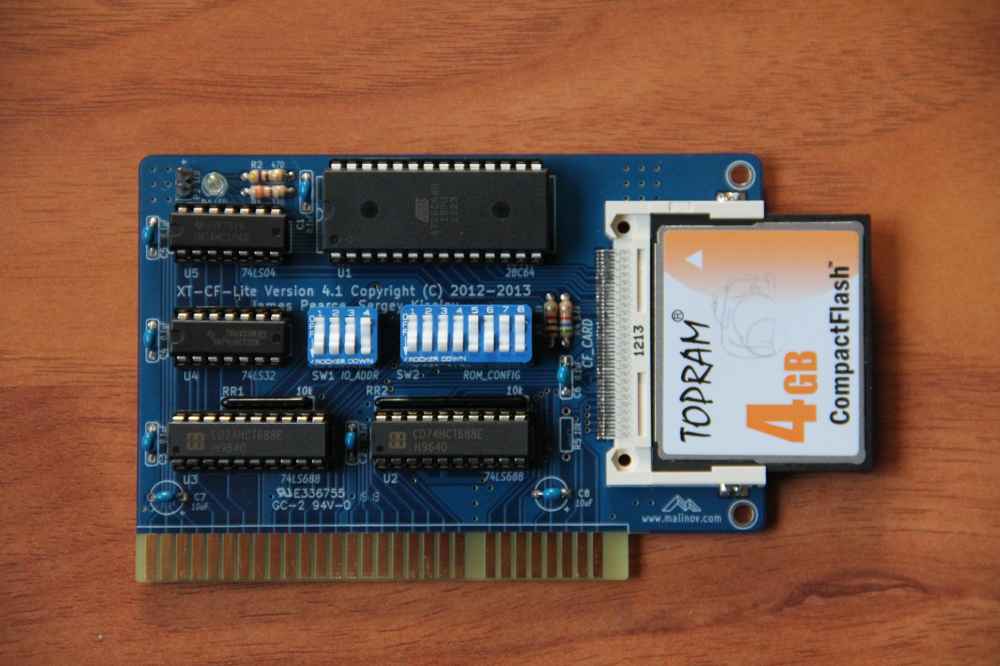

# xt-cf-lite-v4
8-bit ISA interface for Compact Flash cards

## Introduction

XT-CF-Lite V4 is a remake of James Pearce's [XT-CF-Lite](http://www.lo-tech.co.uk/wiki/XT-CF-lite) card, which in its turn is a simplified version of his CPLD based [XT-CF]() card, and shares some ideas with XT-IDE card. This card allows connecting a Compact Flash (CF) card to computers with ISA bus and using it as a mass storage device. The card also supports BIOS extension ROM.

The main difference from the original XF-CF-Lite is using through hole components except of CF connector. Other differences are:

* 8 KiB EEPROM (28C64) or 8 KiB EPROM (27C64) instead of a flash ROM.
* Slightly different activity LED circuit (saves one IC).

## Hardware Documentation

### Schematic and PCB Layout

[Schematic - Version 4.0c](KiCad/XT-CF-Lite-Schematic-4.0c.pdf)

[PCB Layout - Version 4.0c](KiCad/XT-CF-Lite-Board-4.0c.pdf)

### DIP Switches Settings

#### SW1 - I/O Address Selection

SW1.1 | SW1.2 | SW1.3 | I/O Address
----- | ----- | ----- | -----------
ON    | ON    | ON    | 0x300
ON    | ON    | OFF   | 0x320
ON    | OFF   | OFF   | 0x360
OFF   | ON    | ON    | 0x380
OFF   | ON    | OFF   | 0x3A0
OFF   | OFF   | ON    | 0x3C0
OFF   | OFF   | OFF   | 0x3E0

#### SW1.4 - Not Used

#### SW2.1 - EEPROM Enable

SW2.1 | EEPROM Enable
----- | -------------
OFF   | EEPROM disabled
ON    | EEPROM enabled

#### SW2.2 - EEPROM Write Enable

SW2.2 | EEPROM Write Enable
----- | -------------------
OFF   | EEPROM write disabled
ON    | EEPROM write enabled

#### SW2.3 - SW2.7 - EEPROM Address Selection

SW2.3 | SW2.4 | SW2.5 | SW2.6 | SW2.7 | EEPROM Address
----- | ----- | ----- | ----- | ----- | --------------
ON    | ON    | ON    | ON    | ON    | 0xC0000
ON    | ON    | ON    | ON    | OFF   | 0xC2000
ON    | ON    | ON    | OFF   | ON    | 0xC4000
ON    | ON    | ON    | OFF   | OFF   | 0xC6000
ON    | ON    | OFF   | ON    | ON    | 0xC8000
ON    | ON    | OFF   | ON    | OFF   | 0xCA000
ON    | ON    | OFF   | OFF   | ON    | 0xCC000
ON    | ON    | OFF   | OFF   | OFF   | 0xCE000
ON    | OFF   | ON    | ON    | ON    | 0xD0000
ON    | OFF   | ON    | ON    | OFF   | 0xD2000
ON    | OFF   | ON    | OFF   | ON    | 0xD4000
ON    | OFF   | ON    | OFF   | OFF   | 0xD6000
ON    | OFF   | OFF   | ON    | ON    | 0xD8000
ON    | OFF   | OFF   | ON    | OFF   | 0xDA000
ON    | OFF   | OFF   | OFF   | ON    | 0xDC000
ON    | OFF   | OFF   | OFF   | OFF   | 0xDE000
OFF   | ON    | ON    | ON    | ON    | 0xE0000
OFF   | ON    | ON    | ON    | OFF   | 0xE2000
OFF   | ON    | ON    | OFF   | ON    | 0xE4000
OFF   | ON    | ON    | OFF   | OFF   | 0xE6000
OFF   | ON    | OFF   | ON    | ON    | 0xE8000
OFF   | ON    | OFF   | ON    | OFF   | 0xEA000
OFF   | ON    | OFF   | OFF   | ON    | 0xEC000
OFF   | ON    | OFF   | OFF   | OFF   | 0xEE000
OFF   | OFF   | ON    | ON    | ON    | 0xF0000
OFF   | OFF   | ON    | ON    | OFF   | 0xF2000
OFF   | OFF   | ON    | OFF   | ON    | 0xF4000

Notes:

* Make sure that selected I/O and EEPROM addresses do not conflict with other devices
  * Addresses 0xC0000 - 0xC6000 will conflict with EGA/VGA BIOS extension
  * Addresses 0xC8000 - 0xCA000 might conflict with XT Hard Disk BIOS extension
  * Addresses 0xE0000 and up might conflict with system BIOS on newer motherboards
* It is recommended to disable EEPROM write once XT IDE BIOS extension is programmed and configured

### Bill of Materials

Component Type | Reference | Description                             | Quantity | Possible Sources and Notes
-------------- | --------- | --------------------------------------- | -------- | --------------------------
PCB            |           | XT-CF-Lite V4 PCB                       | 1        | [Todd Goodman](https://retrobrewcomputers.org/doku.php?id=boardinventory) or your favorite PCB manufacturer
Capacitor      | C1 - C6   | 0.1 uF ceramic, 5.08 mm lead spacing    | 6        | Mouser 810-FK28X7R1H104K
Capacitor      | C7 - C8   | 10 uF ceramic, 5.08 mm lead spacing     | 2        | Mouser 810-FK24X5R1C106K. Note: Can be replaced with tantalum or electrolytic capacitors
LED            | D1        | 3 mm (T-1) LED indicator                | 1        | Mouser 604-WP3A8GD
Connector      | P1        | Compact Flash Card connector            | 1        | Mouser 517-N7E50-Q516RB-40
Connector      | P2        | 2x1 pin header                          | 1        | Mouser 649-78229-102HLF
Resistor       | R1        | 330 Ohm, 1/4 W                          | 1        | Mouser 291-330-RC
Resistor       | R2        | 470 Ohm, 1/4 W                          | 1        | Mouser 291-470-RC
Resistor       | R3        | 1 kOhm, 1/4 W                           | 1        | Mouser 291-1K-RC
Resistor       | R4        | 5.6 kOhm, 1/4 W                         | 1        | Mouser 291-5.6K-RC
Resistor       | R5        | 10 kOhm, 1/4 W                          | 0        | Note: Do not install
Resistor Array | RR1       | 10 kOhm, 6 pin, bussed resistor array   | 1        | Mouser 264-10K-RC
Resistor Array | RR2       | 10 kOhm, 10 pin, bussed resistor array  | 1        | Mouser 266-10K-RC
Switch         | SW1       | 4 positions DIP switch                  | 1        | Mouser 506-54356402
Switch         | SW2       | 8 positions DIP switch                  | 1        | Mouser 571-54356405
IC             | U1        | 28C64 EEPROM or 27C64 UV erasable EPROM | 1        | Mouser 556-AT28C64B15PU. Note: Atmel AT28C64B is the recommended part
IC             | U2, U3    | 74LS688 magnitude comparator            | 2        | Mouser 595-CD74HCT688E, 771-74HCT688N, 595-SN74LS688N, 595-SN74LS688NE4
IC             | U4        | 74LS32 quad 2-input OR gate             | 1        | Mouser 595-SN74ALS32N, 512-DM74ALS32N, 595-SN74AHCT32N
IC             | U5        | 74LS04 hex inverters                    | 1        | Mouser 595-SN74ALS04BNE4, 595-SN74ALS04BN, 595-SN74AHCT04NE4
IC Socket      | U1        | 28 pin 600 mil (wide) DIP socket        | 1        | Mouser 517-4828-6000-CP. Note: U4 socket is only required for BIOS extension ROM function
IC Socket      | U2, U3    | 20 pin 300 mil (narrow) DIP socket      | 2        | Mouser 517-4820-3000-CP
IC Socket      | U4, U5    | 14 pin 300 mil DIP socket               | 2        | Mouser 517-4814-3000-CP
Bracket        |           | ISA card bracket - Keystone 9202        | 1        | Mouser 534-9202
Screw          |           | Screw, 4-40 thread, 1/4" length         | 2        | Mouser 534-9900
